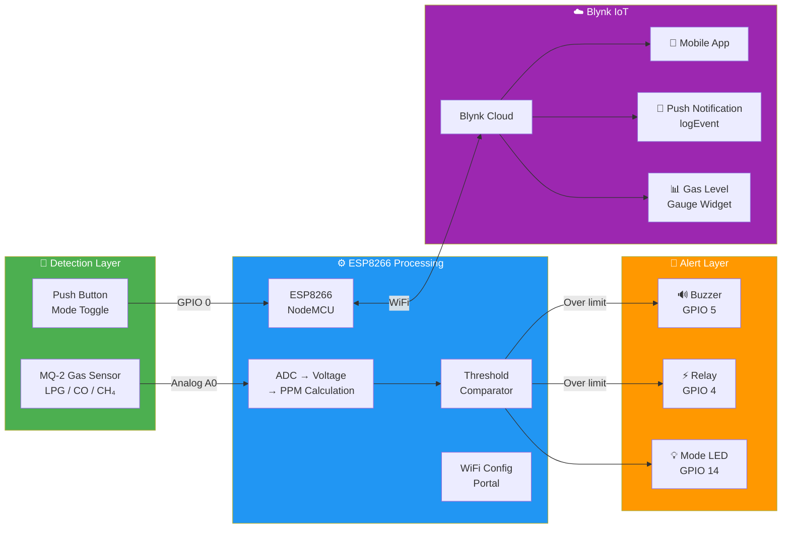

<div align="center">

# 🔥 Smart Gas Leakage Detector
### Hệ Thống Phát Hiện Rò Rỉ Khí Gas Thông Minh

[](https://www.espressif.com/)
[](https://isocpp.org/)
[](https://blynk.io/)
[](https://www.pololu.com/product/1478)

**Hệ thống IoT phát hiện rò rỉ khí gas (LPG, CO, CH₄) real-time với cảnh báo đa kênh qua Buzzer + Relay + Push Notification (Blynk), tích hợp WiFi Config Portal.**

**IoT gas leakage detection system (LPG, CO, CH₄) with multi-channel alerts via Buzzer + Relay + Push Notification (Blynk), featuring WiFi Config Portal.**

</div>

---

## 📸 Demo

<div align="center">

### Sơ đồ đấu nối / Wiring Diagram


*Sơ đồ kết nối ESP8266 NodeMCU với MQ-2, Buzzer, Relay và LED*

</div>

---

## 📐 System Architecture / Kiến Trúc Hệ Thống



---

## 🛠️ Tech Stack / Công Nghệ

| Layer | Technology |
|-------|-----------|
| **MCU** |  |
| **Language** |   |
| **Sensor** |  |
| **IoT Platform** |  |
| **WiFi Config** |  |

---

## ⚡ Key Features & Metrics / Tính Năng & Chỉ Số

| Feature | Metric |
|---------|--------|
| 🔬 **Phát hiện đa khí** / Multi-gas Detection | MQ-2 nhận diện **LPG, CO, CH₄, khói** — đọc analog `A0` mỗi **1 giây** |
| 🧮 **Tính PPM chính xác** / PPM Calculation | `Voltage = ADC/1024 × 5V`, `Ratio = V/1.4`, `PPM = 1000 × 10^((log₁₀(ratio) - 1.0278) / 0.6629)` |
| ⚙️ **Ngưỡng cảnh báo tùy chỉnh** / Adjustable Threshold | Thay đổi `mức cảnh báo` (PPM) từ xa qua **Blynk Slider Widget** (`V2`) |
| 🔔 **Cảnh báo đa kênh** / Multi-channel Alert | **Buzzer** + **Relay** (bật quạt hút / van khí) + **Push Notification** (Blynk logEvent) |
| 📱 **Push Notification** / Mobile Alert | Gửi cảnh báo tức thì lên điện thoại khi vượt ngưỡng, cooldown **60 giây** tránh spam |
| 🔘 **Chế độ ON/OFF** / Mode Toggle | Nút nhấn vật lý (`GPIO 0`) + nút ảo trên app (`V4`) bật/tắt chế độ cảnh báo |
| 📊 **Dashboard real-time** / Blynk Dashboard | Gauge hiển thị PPM (`V1`) + LED trạng thái (`V0`) + trạng thái cảnh báo (`V3`) |
| 🌐 **WiFi Config Portal** / WiFi Setup | Cấu hình SSID, Password, Blynk Auth Token qua web portal — không cần hard-code |

---

## 🔌 Hardware Setup / Sơ Đồ Đấu Nối

### Pinout Table / Bảng Nối Chân

| Component | Pin / Signal | ESP8266 (NodeMCU) |
|-----------|-------------|-------------------|
| **MQ-2 Sensor** | AOUT (Analog) | `A0` |
| | VCC | `5V (Vin)` |
| | GND | `GND` |
| **Buzzer** | Signal (+) | `GPIO 5` (D1) |
| **Relay** | IN | `GPIO 4` (D2) |
| **Mode LED** | Anode (+) | `GPIO 14` (D5) |
| **Button** | Signal | `GPIO 0` (D3) + `INPUT_PULLUP` |

### Blynk Virtual Pins

| Virtual Pin | Widget | Function |
|-------------|--------|----------|
| `V0` | LED | Trạng thái kết nối (nhấp nháy) |
| `V1` | Gauge | Giá trị PPM real-time |
| `V2` | Slider | Ngưỡng cảnh báo (PPM) |
| `V3` | Value Display | Trạng thái cảnh báo (ON/OFF) |
| `V4` | Button | Bật/tắt chế độ cảnh báo |

---

## 🚀 How to Run / Hướng Dẫn Chạy

### 1. Hardware / Phần cứng
```
Linh kiện cần chuẩn bị:
• ESP8266 NodeMCU
• MQ-2 Gas Sensor Module
• Relay Module 5V
• Buzzer 5V
• LED + Điện trở 220Ω
• Push Button
• Nguồn 5V (USB)
```

### 2. Software / Phần mềm
```bash
# Clone repository
git clone https://github.com/duc2512/Smart-Gas-Leakage-Detector.git

# Mở CANH_BAO_KHI_GAS_MQ2/CANH_BAO_KHI_GAS_MQ2.ino bằng Arduino IDE
# Open with Arduino IDE

# Cài đặt thư viện / Install libraries:
# - ESP8266 Board Package
# - Blynk (by Volodymyr Shymanskyy)
```

### 3. Cấu hình / Configuration

**Cách 1: WiFi Config Portal (khuyến nghị)**
```
1. Upload code lên ESP8266
2. ESP8266 phát WiFi AP → kết nối vào AP
3. Truy cập 192.168.4.1 → nhập WiFi SSID, Password, Blynk Auth Token
4. ESP8266 tự kết nối WiFi + Blynk
```

**Cách 2: Hard-code** (sửa trong `espConfig.h`)

### 4. Thiết lập Blynk / Blynk Setup
```
1. Tạo project trên Blynk
2. Thêm widgets: LED (V0), Gauge (V1), Slider (V2), Value (V3), Button (V4)
3. Bật Events → tạo event "canhbao" để nhận push notification
```

---

## 📁 Project Structure / Cấu Trúc Dự Án

```
Smart-Gas-Leakage-Detector/
└── CANH_BAO_KHI_GAS_MQ2/
    ├── CANH_BAO_KHI_GAS_MQ2.ino  # 🚀 Main firmware
    │   ├── MQ-2 Analog Read       # ADC → PPM calculation
    │   ├── Threshold Alert         # Buzzer + Relay + Blynk notification
    │   ├── Mode Toggle             # Physical button + Blynk virtual button
    │   └── Blynk Sync             # Real-time cloud sync
    ├── espConfig.h                 # 🌐 WiFi + Blynk configuration library
    ├── configForm.h                # 📄 WiFi Config Portal HTML form
    └── SO DO DAU NOI.png           # 📸 Wiring diagram
```

---

## 👤 Author

**Le Tho Duc** — [GitHub @duc2512](https://github.com/duc2512)

---

<div align="center">
⭐ If you find this project useful, please give it a star! ⭐
</div>
